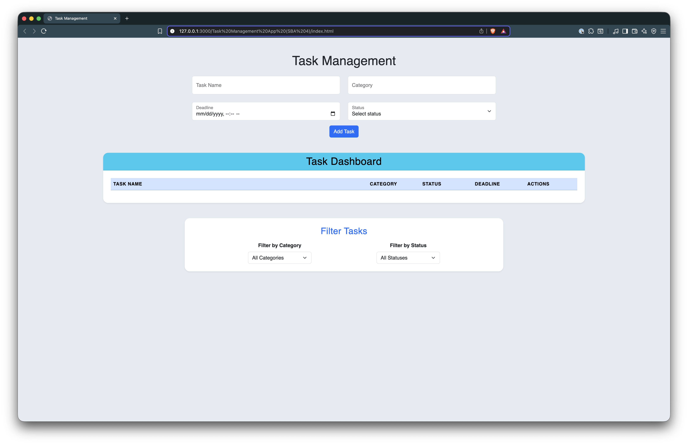
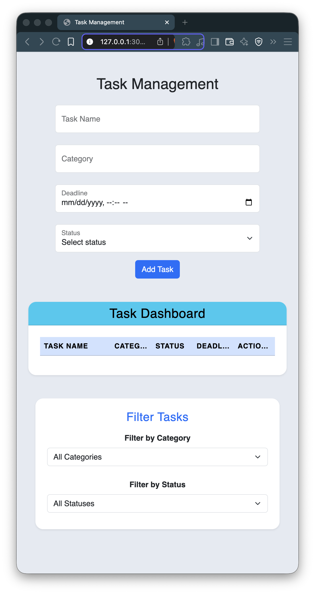

## 📝 Task Management App (SBA4)

### 📖 Overview

The **Task Management App** is a dynamic web-based tool that allows users to efficiently organize and monitor their tasks. Users can add, categorize, and track their progress while the app automatically updates overdue statuses based on deadlines. The project demonstrates strong use of JavaScript fundamentals such as arrays, objects, DOM manipulation, conditionals, and local storage for data persistence.

---

### 🎯 Objectives

The goal of this project was to build an interactive task management system where users can:

-   Add tasks with **name, category, deadline, and status**
-   Update task statuses dynamically (In Progress, Completed, or Overdue)
-   **Auto-detect overdue tasks** based on the current date
-   **Filter tasks** by category or status

---

### 💡 Features

-   ✅ Add and manage multiple tasks
-   🕓 Auto-updates overdue tasks in real-time
-   🔄 Update task status directly from the dashboard
-   🔍 Filter tasks by **category** or **status**
-   📱 Fully responsive for **desktop and mobile** screens
-   🎨 Styled with **Bootstrap 5** and custom CSS

---

### 🖥️ Desktop View



### 📱 Mobile View



---

### 🚀 Live Demo

**View the project live:**
👉 [https://structbase.github.io/Task-Management-App-SBA4/](#)
👉 [https://github.com/structbase/Task-Management-App-SBA4](#)

---

### 🧠 Technologies Used

-   **HTML5** for structure
-   **CSS3 & Bootstrap 5** for responsive design
-   **JavaScript (ES6)** for logic and DOM manipulation
-   **Local Storage API** for persistence

---

### 🧩 How It Works

1. **Add a Task:**
   Fill in the task details — name, category, deadline, and status — and click “Add Task.”
2. **View Dashboard:**
   All tasks are displayed in a clean, responsive table layout.
3. **Update Status:**
   Change the task’s status using a dropdown menu.
4. **Filter Tasks:**
   Use the filter section to view tasks by category or status.
5. **Automatic Updates:**
   The app automatically marks overdue tasks based on the current date.

---

### ⚙️ Setup Instructions

1. Clone the repository:

    ```bash
    git clone https://github.com/structbase/Task-Management-App-SBA4
    ```

2. Navigate into the project folder:

    ```bash
    cd task-management-app
    ```

3. Open `index.html` in your browser to run the app locally.

---

### 📂 Folder Structure

```
Task-Management-App/
│
├── index.html
├── index.js
├── style.css
├── /screenshots
│   ├── desktop-view.png
│   └── mobile-view.png
└── README.md
```

---

### 🪞 Reflection

During this project, one of the main challenges I faced was handling **data filtering** and **status synchronization** while keeping the DOM updates efficient. Initially, filtering logic and dynamic event handling caused bugs because elements were re-rendered without reattaching event listeners. I solved this by separating my rendering logic into smaller, reusable functions and ensuring event listeners were added after every re-render.

Another challenge was ensuring the design remained **responsive** across different screen sizes. I overcame this by using Bootstrap’s grid system and adding custom media queries for smaller viewports.

If given more time, I would improve the app by adding **local storage integration** for saving tasks permanently, **edit functionality**, and possibly a **search bar** to enhance task accessibility and overall usability.
